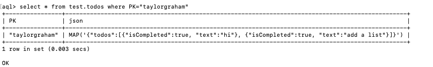

### `Start API Server`


1. Install Dependencies
   ```sh
   npm install 
   ```
2. Start API Server
   ```sh
   node server.js
   ```


### `Start Front-end Server`

1. Change directory to client
   ```sh
   cd client 
   ```
2. Install Dependencies
   ```sh
   npm install 
   ```
3. Start API Server
   ```sh
   npm start
   ```


### `AQL Query JSON Record`
  ```sh
   select * from test.todos where PK="taylorgraham"
   ```


